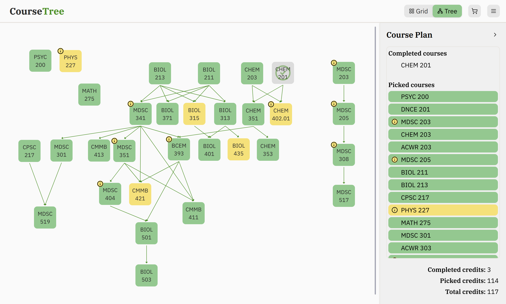
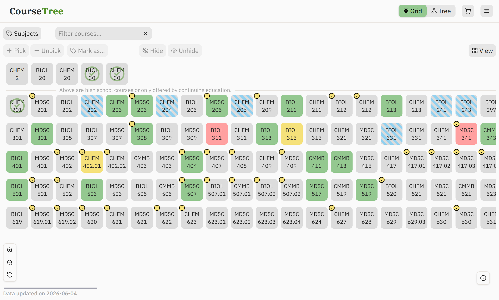

# CourseTree

**Live link:** [CourseTree website](https://arthur-huan.github.io/course-tree/)
**Walkthroughs & resources**: [YouTube](https://www.youtube.com/@CourseTreeApp)

CourseTree turns a university course catalog into an interactive planning tool. A Python scraping and NLP pipeline extracts structured course data and requisite logic from unstructured catalog text, which are visualized through synchronized grid and DAG views built with React and TypeScript.

Built end-to-end by a University of Calgary student, for students.

Browse hundreds of courses at once in a high-density grid, with live requisite feedback that shows conflicts and missing prerequisites as you build your plan. Then, switch to a tree view to trace the full requisite chains and hierarchy of your personal plan.

## Screenshots

*Tree View*

*Grid View*

## Tech Stack

| Layer | Technologies |
|---|---|
| Web scraping | Python, Scrapy, Pydantic |
| Data pipeline | Python, spaCy, Pandas |
| Frontend | React, TypeScript, Vite |
| State management | Zustand |
| Graph rendering | React Flow, Dagre |
| Styling | Tailwind CSS |
| Persistence | Local storage |

## Engineering Challenges

**Scraping a hostile target:** The university catalog presents significant scraping barriers, especially after a recent redesign: randomized URLs, rate limiting, and a JavaScript-rendered interface where course links are never exposed in the DOM and navigation doesn't open addressable pages. Selenium-based scraping was explored but proved too slow at scale. The pipeline instead ingests an exported CSV as a fallback, with the Scrapy spider reduced to a skeleton ingestion layer. A prior version scraped a now-outdated official archive using Scrapy as a fully-fledged crawler.

**Parsing unstructured requisite text:** Catalog descriptions of prerequisites are inconsistent in format and use natural-language boolean logic ("A or B, and C"). Even a few typos are present in the official data. The pipeline uses spaCy for entity extraction combined with rule-based logic to reconstruct the and/or structure, and outputs in a custom DSL that expands upon standard postfix notation. Standard boolean AND/OR logic cannot represent pool-based requisites ("2 courses from ..." or "6 credits from..."), so standard postfix was extended with pool operators to cover the full range of requisite structures found in the catalog to complement standard postfix with normalized operators and course codes.

**Rendering 100+ nodes at once:** Grid View is designed to stay responsive while filtering, selecting, or flagging across 100+ courses, which required being deliberate about what triggers a re-render in the Zustand store rather than relying on component-level state. Tested to 5,000 nodes on lower-mid end consumer hardware, with performance varying by GPU.

**Edge routing in a dense graph:** Naive center-to-center edges between nodes work fine in a sparse graph but break down once a node has 5+ incoming edges, as edges graze neighboring nodes at shallow angles, making it ambiguous which node an arrow actually points to. There would also be no clear hierarchical flow within the graph. This was solved by computing edge endpoints from node geometry, as well as arranging nodes in layers, with prerequisites in earlier rows and unlocked courses in later rows.

**Pointer-event isolation across interactive layers:** Both views stack several interactive surfaces: nodes, detail popovers, a pannable and zoomable canvas, modals for filters and warnings, and a legend. Without explicit event scoping, both display and user interaction can have unintended layering. Each layer's pointer events are scoped independently to prevent this.

**Backward compatibility with savefile versions:** As the features and state variables increased during production, and as decisions about the state variables to persist between sessions change, savefiles undergo different versions with different formats and recorded fields. It is a challenge to maintain backward compatibility such that older savefiles are still accepted and are updated to newer formats consistently.

## Architecture

**Data pipeline:** Raw text from the catalog undergoes basic normalization and parsing and is validated against Pydantic models, and then parsed with spaCy to extract requisite logic (course codes, boolean relationships) from free-form sentences, and shaped into a normalized dataset before being exported for the frontend.

**Frontend state:** Data like course data, selections, flags, and completion status live in singleton Zustand stores. Grid View and Tree View are both pure consumers of this store, neither owns its own copy of course state, which keeps the two views synchronized without manual reconciliation.

**Grid model:** The grid is designed for high information density—100+ courses are visible simultaneously on a single page, giving an at-a-glance overview of an entire program rather than forcing course-by-course navigation. Filters and course hiding then allow narrowing down the scope while maintaining the big-picture view. Requisite satisfaction is computed reactively as a derived value from the store, so conflict feedback and prerequisite status update instantly across all visible courses as the user builds their plan.

**Graph model:** Prerequisite/corequisite relationships are represented as a Directed Acyclic Graph (DAG): courses as nodes, requirements as directed edges. React Flow is used to render the DAG, with Dagre to compute node layout and custom edge routing (see below).

**Local-first persistence:** All application state is stored in the browser. There's no backend database or account system: backup/export and restore/import are the mechanisms for moving data between sessions or devices. This gives users full control of their own data.

## Key Features

- **Grid View:**  A high-density course browser designed for overview: 100+ courses visible simultaneously on a single page.
    * **Reactive state display:** Each course renders background color, fill pattern, and icon combinations reflecting its states in three axes: user-decided semantics (e.g. picking a course or marking it as completed), calculated semantic states in relation to requisite status, and UI states
    * **Planned vs completed:** Distinguish between courses already completed and passed, versus planned selections
    * **Live requisites feedback:** State updates instantly as the user builds their plan, with conflicts and missing prerequisites surfacing automatically across all visible courses
    * **Bulk selection**: Select nodes in bulk to perform actions, e.g. pick, mark as completed, flag, hide, etc.
    * **Filter:** Filter by subjects, or with a keyword quick filter that enables zeroing in on a course code
- **Tree View:** An interactive DAG visualization of course relationships, useful for tracing requisite chains and understanding progression, not just browsing a list.
    * **Reactive state display:** Shares the same state model and node rendering as Grid View.
    * **Draggable nodes:** Allows dragging nodes to reorder the tree according to user preference
- **Shared course plan sidebar:** Visible across both views, reflecting the same underlying state. Shows two sections: completed courses and planned courses.
- **Backup & restore:** Export/import application state as a file. Restore has validation and automatic conversion between different versions of the savefile format.

## Data & Privacy

All application data lives in the browser via local storage. There is no account system, no cookies, and no user data is transmitted to or stored on external servers. Portability is handled entirely through manual export/import of backup files. Users do not give out identifiable information and have full control over their own data.
